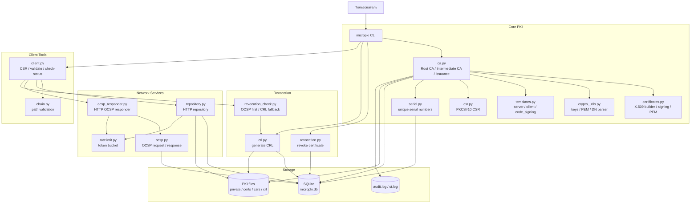
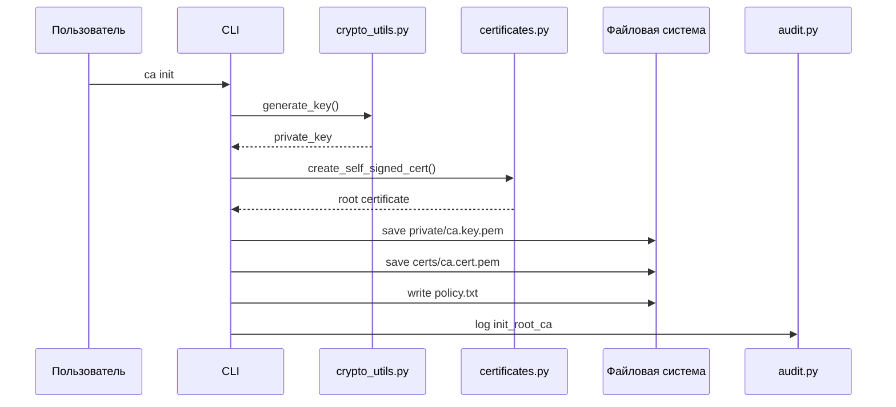
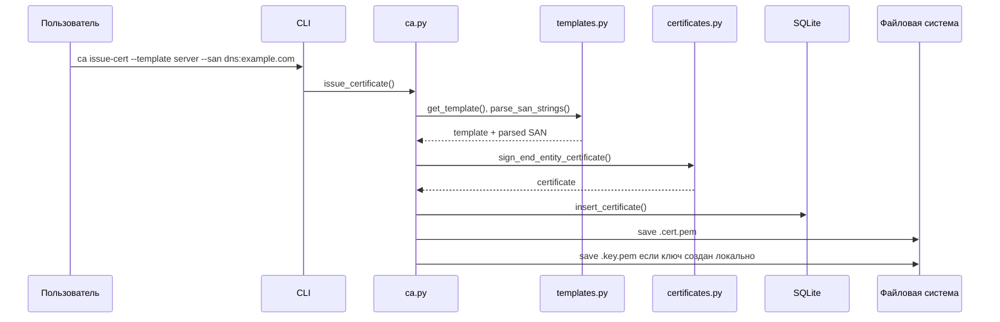
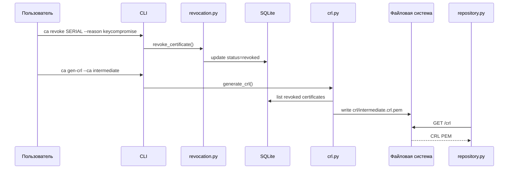
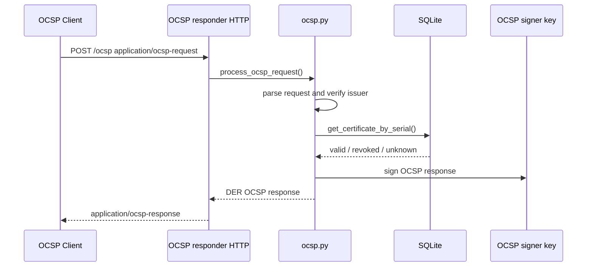
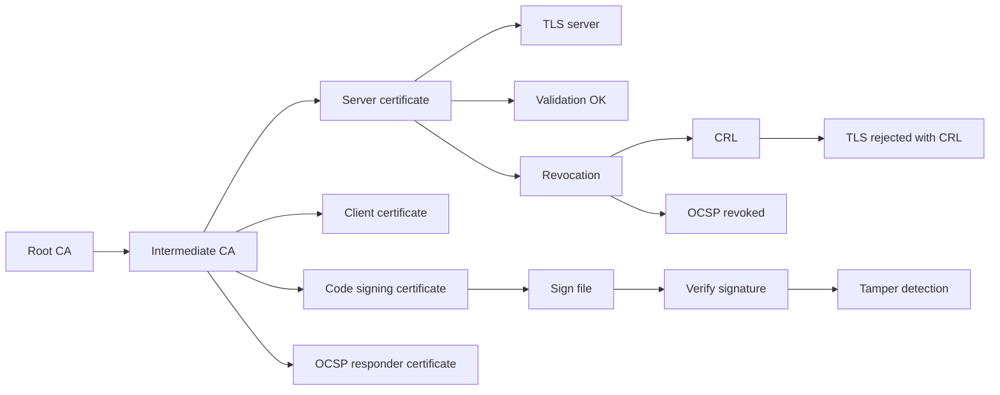
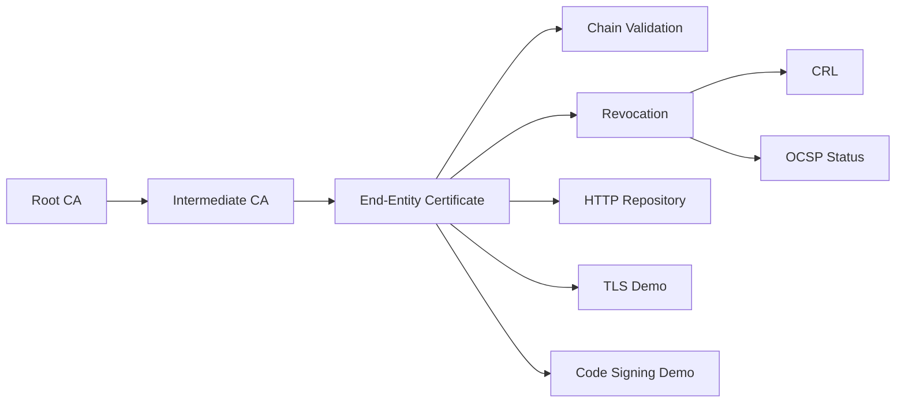

# MicroPKI

**MicroPKI** — учебная мини-инфраструктура открытых ключей на Python. Проект демонстрирует полный жизненный цикл X.509-сертификатов в локальной PKI: создание Root CA, выпуск Intermediate CA, выпуск конечных сертификатов, хранение сертификатов в SQLite, отзыв, CRL, OCSP, проверку цепочек, клиентские инструменты, аудит и финальный демонстрационный сценарий.

Проект предназначен для курсовой работы и локальной демонстрации PKI. Он показывает основные механизмы PKI, но не является production-ready удостоверяющим центром.

---

## Содержание

1. [Назначение проекта](#назначение-проекта)
2. [Возможности](#возможности)
3. [Архитектура](#архитектура)
4. [Диаграммы процессов](#диаграммы-процессов)
5. [Соответствие спринтам](#соответствие-спринтам)
6. [Структура проекта](#структура-проекта)
7. [Установка и запуск](#установка-и-запуск)
8. [CLI Reference](#cli-reference)
9. [API Reference](#api-reference)
10. [Demo Walkthrough](#demo-walkthrough)
11. [TLS-демонстрация](#tls-демонстрация)
12. [Code Signing Demo](#code-signing-demo)
13. [Тестирование](#тестирование)
14. [Финальный Git-релиз](#финальный-git-релиз)
15. [Безопасность и ограничения](#безопасность-и-ограничения)
16. [Итог](#итог)

---

## Назначение проекта

MicroPKI решает задачу построения минимальной, но целостной PKI-системы. В рамках проекта реализованы:

- генерация RSA и ECC ключей;
- создание самоподписанного Root CA;
- выпуск Intermediate CA;
- выпуск end-entity сертификатов по шаблонам `server`, `client`, `code_signing`;
- поддержка CSR;
- проверка цепочки сертификатов;
- хранение выпущенных сертификатов в SQLite;
- уникальная генерация серийных номеров;
- отзыв сертификатов;
- генерация CRL;
- HTTP-репозиторий сертификатов и CRL;
- OCSP responder;
- клиентские операции для генерации CSR, запроса сертификата и проверки статуса;
- аудит, базовые политики, transparency log и ограничение частоты запросов;
- финальный автоматизированный demo script с TLS и code signing.

---

## Возможности

| Компонент | Возможность |
|---|---|
| Root CA | Создание самоподписанного корневого сертификата, encrypted private key, policy.txt |
| Intermediate CA | Выпуск промежуточного CA от Root CA, pathLenConstraint, encrypted private key |
| Certificate Templates | Шаблоны `server`, `client`, `code_signing`, KeyUsage, ExtendedKeyUsage, SAN |
| CSR | Генерация CSR на клиенте и выпуск сертификата по CSR |
| SQLite Repository | Хранение сертификатов, статусов, CRL metadata и уникальных serial numbers |
| Revocation | `ca revoke`, причины отзыва, статус `revoked` в БД |
| CRL | Генерация X.509 CRL, CRL Number, HTTP-доставка CRL |
| OCSP | OCSP signer certificate, OCSP responder, ответы `good`, `revoked`, `unknown`, nonce |
| Client Tools | `client gen-csr`, `client validate`, `client check-status` |
| Audit/Security | audit log, policy checks, rate limiting, transparency log |
| Demo | `demo/demo.sh`: полный сценарий, TLS через `openssl s_server`, `curl`, CRL, code signing |

---

## Архитектура



Архитектура состоит из пяти основных частей: CLI, ядро CA, SQLite/файловое хранилище, сетевые сервисы repository/OCSP и клиентские инструменты проверки.

---

## Диаграммы процессов

### Выпуск Root CA



### Выпуск конечного сертификата



### Отзыв сертификата и CRL



### OCSP-проверка



---

## Соответствие спринтам

| Спринт | Требование | Реализация | Тесты | Статус |
|---:|---|---|---|---|
| 1 | Базовая криптография, Root CA, структура PKI | `crypto_utils.py`, `certificates.py`, `ca.py`, `logger.py` | `test_crypto_utils.py`, `test_certificates.py`, `test_ca.py` | Реализовано |
| 2 | Intermediate CA, end-entity сертификаты, шаблоны, CSR, проверка цепочки | `ca.py`, `csr.py`, `templates.py`, `chain.py` | `test_intermediate.py`, `test_templates.py`, `test_csr.py`, `test_chain.py`, `test_cli_sprint.py` | Реализовано |
| 3 | SQLite-база, серийные номера, CLI list/show, HTTP repository | `database.py`, `serial.py`, `repository.py`, `cli.py` | `test_db_cli.py`, `serial_uniqueness.py`, `test_repository_api.py` | Реализовано |
| 4 | Отзыв сертификатов, причины отзыва, CRL, HTTP-доступ к CRL | `revocation.py`, `crl.py`, `repository.py` | `test_sprint4.py` | Реализовано |
| 5 | OCSP responder, OCSP signer certificate, ответы good/revoked/unknown, nonce | `ocsp.py`, `ocsp_responder.py`, `ca.py` | `test_sprint5.py` | Реализовано |
| 6 | Клиентские функции: CSR, запрос сертификата, validate, check-status | `client.py`, `revocation_check.py`, `repository.py` | `test_client_logic.py` | Реализовано |
| 7 | Усиление безопасности: аудит, политики, rate limiting, transparency log | `audit.py`, `policy.py`, `ratelimit.py`, `transparency.py` | покрывается интеграционными тестами и demo-сценарием | Реализовано частично, достаточно для учебного стенда |
| 8 | Интеграция, demo, TLS, code signing, документация, производительность | `demo/demo.sh`, `README.md`, тесты | `test_performance.py`, полный `pytest -v`, ручной demo run | Реализовано |

---

## Структура проекта

| Путь | Назначение |
|---|---|
| `micropki/__init__.py` | Публичный API пакета. |
| `micropki/__main__.py` | Точка входа при запуске `python -m micropki`. |
| `micropki/cli.py` | CLI-парсер и обработчики команд. |
| `micropki/ca.py` | Root CA, Intermediate CA, end-entity сертификаты, OCSP signer certificate. |
| `micropki/certificates.py` | Создание, подпись, сериализация и загрузка X.509-сертификатов. |
| `micropki/crypto_utils.py` | Генерация ключей, PEM, загрузка ключей, разбор DN. |
| `micropki/csr.py` | Создание, сериализация, загрузка и проверка CSR. |
| `micropki/templates.py` | Шаблоны `server`, `client`, `code_signing`, SAN и KeyUsage/EKU. |
| `micropki/chain.py` | Проверка цепочки сертификатов. |
| `micropki/database.py` | SQLite-хранилище сертификатов, статусов, revocation metadata и CRL metadata. |
| `micropki/serial.py` | Генерация уникальных серийных номеров. |
| `micropki/revocation.py` | Отзыв сертификатов и RFC 5280 reason codes. |
| `micropki/crl.py` | Генерация CRL и сохранение CRL metadata. |
| `micropki/revocation_check.py` | Проверка статуса через OCSP с fallback на CRL. |
| `micropki/repository.py` | HTTP repository для сертификатов CA, leaf-сертификатов и CRL. |
| `micropki/ocsp.py` | Разбор OCSP-запросов и генерация OCSP-ответов. |
| `micropki/ocsp_responder.py` | HTTP OCSP responder. |
| `micropki/client.py` | Клиентские операции: CSR, request-cert, validate, check-status. |
| `micropki/config.py` | Конфигурация из YAML или значения по умолчанию. |
| `micropki/audit.py` | Аудит операций. |
| `micropki/policy.py` | Проверки политик ключей, SAN и срока действия. |
| `micropki/ratelimit.py` | Token Bucket rate limiting. |
| `micropki/transparency.py` | Локальный transparency log для выпущенных сертификатов. |
| `demo/demo.sh` | Автоматический финальный demo script. |
| `tests/test_*.py` | Unit, integration, CLI, repository, CRL, OCSP и performance-тесты. |

---

## Установка и запуск

### 1. Создать виртуальное окружение

Linux/macOS:

```bash
python3 -m venv .venv
source .venv/bin/activate
```

Windows PowerShell:

```powershell
python -m venv .venv
.\.venv\Scripts\Activate.ps1
```

Если PowerShell блокирует активацию:

```powershell
Set-ExecutionPolicy -Scope Process -ExecutionPolicy Bypass
.\.venv\Scripts\Activate.ps1
```

### 2. Установить зависимости

```bash
python -m pip install --upgrade pip
pip install cryptography requests pytest pytest-cov pyyaml
```

Минимальный `requirements.txt`:

```txt
cryptography>=42.0.0
requests>=2.31.0
pytest>=8.0.0
pytest-cov>=5.0.0
PyYAML>=6.0.0
```

Для TLS и code signing demo дополнительно нужны системные утилиты:

```bash
openssl version
curl --version
```

### 3. Проверить импорты

```bash
python -c "import micropki; import micropki.ca; import micropki.cli; print('imports ok')"
```

Ожидаемый результат:

```text
imports ok
```

---

## CLI Reference

CLI запускается через:

```bash
python -m micropki <command> [options]
```

### `ca init`

Создаёт самоподписанный Root CA.

```bash
python -m micropki ca init \
  --subject "CN=Demo Root CA,O=DemoOrg,C=RU" \
  --key-type rsa \
  --key-size 4096 \
  --passphrase-file ./pki/secrets/root.pass \
  --out-dir ./pki \
  --validity-days 3650
```

### `db init`

Инициализирует SQLite-базу.

```bash
python -m micropki db init --db-path ./pki/micropki.db
```

### `ca issue-intermediate`

Выпускает Intermediate CA, подписанный Root CA.

```bash
python -m micropki ca issue-intermediate \
  --root-cert ./pki/certs/ca.cert.pem \
  --root-key ./pki/private/ca.key.pem \
  --root-pass-file ./pki/secrets/root.pass \
  --subject "CN=Demo Intermediate CA,O=DemoOrg" \
  --key-type rsa \
  --key-size 4096 \
  --passphrase-file ./pki/secrets/intermediate.pass \
  --out-dir ./pki \
  --validity-days 1825 \
  --pathlen 0
```

### `ca issue-cert`

Выпускает конечный сертификат по шаблону.

```bash
python -m micropki ca issue-cert \
  --ca-cert ./pki/certs/intermediate.cert.pem \
  --ca-key ./pki/private/intermediate.key.pem \
  --ca-pass-file ./pki/secrets/intermediate.pass \
  --template server \
  --subject "CN=localhost,O=DemoOrg" \
  --san "dns:localhost" \
  --out-dir ./pki/certs \
  --validity-days 365
```

Поддерживаемые шаблоны:

| Шаблон | Назначение | SAN |
|---|---|---|
| `server` | TLS server certificate | `dns`, `ip`, SAN обязателен |
| `client` | TLS/client authentication | `email`, `dns`, также допускаются `ip`, `uri` |
| `code_signing` | Подпись кода/файлов | `dns`, `uri`, SAN необязателен |

### `ca validate-chain`

Проверяет цепочку leaf → intermediate → root.

```bash
python -m micropki ca validate-chain \
  --cert ./pki/certs/localhost.cert.pem \
  --intermediate ./pki/certs/intermediate.cert.pem \
  --root ./pki/certs/ca.cert.pem
```

### `ca list-certs`

Показывает сертификаты из базы.

```bash
python -m micropki ca list-certs --status valid --format table
python -m micropki ca list-certs --format json
python -m micropki ca list-certs --format csv
```

### `ca show-cert`

Печатает PEM сертификата по serial number.

```bash
python -m micropki ca show-cert SERIAL_HEX
```

### `ca revoke`

Отзывает сертификат.

```bash
python -m micropki ca revoke SERIAL_HEX --reason keycompromise --force
```

Поддерживаемые причины: `unspecified`, `keycompromise`, `cacompromise`, `affiliationchanged`, `superseded`, `cessationofoperation`, `certificatehold`, `removefromcrl`, `privilegewithdrawn`, `aacompromise`.

### `ca gen-crl`

Генерирует CRL.

```bash
python -m micropki ca gen-crl --ca intermediate --out-dir ./pki
python -m micropki ca gen-crl --ca root --out-dir ./pki
```

### `ca issue-ocsp-cert`

Выпускает специальный OCSP signing certificate.

```bash
python -m micropki ca issue-ocsp-cert \
  --ca-cert ./pki/certs/intermediate.cert.pem \
  --ca-key ./pki/private/intermediate.key.pem \
  --ca-pass-file ./pki/secrets/intermediate.pass \
  --subject "CN=OCSP Responder,O=DemoOrg" \
  --key-type rsa \
  --key-size 2048 \
  --out-dir ./pki/certs \
  --validity-days 365
```

### `repo serve`

Запускает HTTP-репозиторий сертификатов и CRL.

```bash
python -m micropki repo serve \
  --host 127.0.0.1 \
  --port 8080 \
  --db-path ./pki/micropki.db \
  --cert-dir ./pki/certs
```

С rate limiting:

```bash
python -m micropki repo serve --rate-limit 5 --rate-burst 10
```

### `ocsp serve`

Запускает OCSP responder.

```bash
python -m micropki ocsp serve \
  --host 127.0.0.1 \
  --port 8081 \
  --db-path ./pki/micropki.db \
  --responder-cert ./pki/certs/OCSP_Responder.cert.pem \
  --responder-key ./pki/certs/OCSP_Responder.key.pem \
  --ca-cert ./pki/certs/intermediate.cert.pem
```

### `client gen-csr`

Создаёт private key и CSR.

```bash
python -m micropki client gen-csr \
  --subject "CN=client.example.com,O=DemoOrg" \
  --san dns:client.example.com \
  --key-type rsa \
  --key-size 2048 \
  --out-key ./client.key.pem \
  --out-csr ./client.csr.pem
```

### `client validate`

Проверяет сертификат и цепочку.

```bash
python -m micropki client validate \
  --cert ./pki/certs/localhost.cert.pem \
  --untrusted ./pki/certs/intermediate.cert.pem \
  --trusted ./pki/certs/ca.cert.pem \
  --mode full \
  --crl ./pki/crl/intermediate.crl.pem
```

### `client check-status`

Проверяет статус сертификата через OCSP/CRL.

```bash
python -m micropki client check-status \
  --cert ./pki/certs/localhost.cert.pem \
  --ca-cert ./pki/certs/intermediate.cert.pem \
  --crl ./pki/crl/intermediate.crl.pem
```

### `audit verify`

Проверяет целостность audit log.

```bash
python -m micropki audit verify --log-file ./pki/audit.log
```

---

## API Reference

HTTP API предоставляет `repository.py`.

### `GET /certificate/<serial>`

Возвращает PEM-сертификат по serial number.

```bash
curl http://127.0.0.1:8080/certificate/2A7F1234 --output cert.pem
```

Ответы:

| Код | Значение |
|---:|---|
| 200 | Сертификат найден, `Content-Type: application/x-pem-file` |
| 400 | Serial number отсутствует или не hex |
| 404 | Сертификат не найден |
| 500 | Ошибка БД |

### `GET /ca/root`

Возвращает Root CA certificate.

```bash
curl http://127.0.0.1:8080/ca/root --output root.pem
```

### `GET /ca/intermediate`

Возвращает Intermediate CA certificate.

```bash
curl http://127.0.0.1:8080/ca/intermediate --output intermediate.pem
```

### `GET /crl`

Возвращает default CRL, обычно Intermediate CRL.

```bash
curl http://127.0.0.1:8080/crl --output intermediate.crl.pem
```

### `GET /crl?ca=root`

Возвращает CRL выбранного CA.

```bash
curl "http://127.0.0.1:8080/crl?ca=root" --output root.crl.pem
```

### `GET /crl/<ca>.crl`

Альтернативный REST-friendly путь.

```bash
curl http://127.0.0.1:8080/crl/intermediate.crl --output intermediate.crl.pem
```

### `POST /request-cert?template=<template>`

Принимает CSR и возвращает выпущенный PEM-сертификат. Для учебной демонстрации используется простой API key через `X-API-Key`.

```bash
curl -X POST \
  -H "Content-Type: application/x-pem-file" \
  -H "X-API-Key: changeme" \
  --data-binary @client.csr.pem \
  "http://127.0.0.1:8080/request-cert?template=server" \
  --output issued.cert.pem
```

> В финальном demo-сценарии выпуск сертификатов выполняется через CLI, потому что это наиболее стабильный путь для локальной сдачи. Endpoint `/request-cert` оставлен как часть API reference и учебной демонстрации HTTP issuance workflow.

### `POST /ocsp`

OCSP responder принимает DER-encoded OCSP request и возвращает DER-encoded OCSP response.

```bash
openssl ocsp \
  -issuer ./pki/certs/intermediate.cert.pem \
  -cert ./pki/certs/localhost.cert.pem \
  -url http://127.0.0.1:8081/ocsp \
  -resp_text
```

---

## Demo Walkthrough

Финальная демонстрация находится в файле:

```text
demo/demo.sh
```

Скрипт закрывает требования **DEMO-1**, **DEMO-5**, **TLS-1**, **TLS-3**, **CSIGN-2**, **CSIGN-3**, **CSIGN-4**.

### Запуск demo

```bash
chmod +x demo/demo.sh
./demo/demo.sh
```

Скрипт выполняет полный сценарий:

1. Создаёт временную директорию demo-стенда.
2. Создаёт passphrase-файлы для Root CA и Intermediate CA.
3. Инициализирует Root CA.
4. Инициализирует SQLite database.
5. Выпускает Intermediate CA.
6. Выпускает server certificate для `localhost`.
7. Выпускает client certificate.
8. Выпускает code signing certificate.
9. Выпускает OCSP responder certificate.
10. Генерирует CRL.
11. Запускает HTTP repository server.
12. Проверяет получение Root CA, Intermediate CA и CRL через `curl`.
13. Запускает OCSP responder.
14. Проверяет OCSP-status для server certificate.
15. Запускает TLS-сервер через `openssl s_server`.
16. Проверяет TLS-подключение через `curl --cacert`.
17. Отзывает server certificate.
18. Генерирует новую CRL.
19. Демонстрирует, что TLS-проверка с CRL должна отклонить revoked certificate.
20. Подписывает файл code signing ключом.
21. Проверяет подпись файла.
22. Изменяет файл и показывает, что подпись больше не проходит.
23. Проверяет audit log integrity, если audit log создан.
24. Останавливает все background-серверы.

Ожидаемый формат вывода:

```text
[PASS] Root CA created
[PASS] Intermediate CA created
[PASS] Repository server started
[PASS] TLS connection verified with custom Root CA
[PASS] Revoked certificate rejected with CRL check
[PASS] Code signature verification successful
[PASS] Tampered file signature verification failed as expected
```

### Что демонстрирует demo

Demo показывает не просто отдельные команды, а полный жизненный цикл PKI:



---

## TLS-демонстрация

TLS-демонстрация выполняется автоматически в `demo/demo.sh`, но её можно повторить вручную.

### 1. Запуск HTTPS/TLS server через OpenSSL

```bash
openssl s_server \
  -accept 8443 \
  -cert ./pki/certs/localhost.cert.pem \
  -key ./pki/certs/localhost.key.pem \
  -www
```

### 2. Успешная проверка через curl с Root CA

```bash
curl --cacert ./pki/certs/ca.cert.pem https://localhost:8443/
```

Без `--cacert` подключение должно считаться недоверенным, потому что Root CA является локальным учебным CA и не находится в системном trust store.

### 3. Revocation check через CRL

После отзыва server certificate:

```bash
python -m micropki ca revoke SERIAL_HEX --reason keycompromise --force
python -m micropki ca gen-crl --ca intermediate --out-dir ./pki
```

Проверка через curl с CRL:

```bash
curl \
  --cacert ./pki/certs/ca.cert.pem \
  --crlfile ./pki/crl/intermediate.crl.pem \
  https://localhost:8443/
```

Ожидаемый результат после отзыва: клиент должен отклонить сертификат при включённой CRL-проверке.

---

## Code Signing Demo

Code signing demo выполняется автоматически в `demo/demo.sh` и показывает требования **CSIGN-2**, **CSIGN-3**, **CSIGN-4**.

### 1. Создать файл для подписи

```bash
echo 'print("Hello from signed script")' > demo-script.py
```

### 2. Подписать файл code signing private key

```bash
openssl dgst -sha256 \
  -sign ./pki/certs/MicroPKI_Code_Signer.key.pem \
  -out demo-script.py.sig \
  demo-script.py
```

### 3. Проверить подпись public key из сертификата

```bash
openssl x509 \
  -in ./pki/certs/MicroPKI_Code_Signer.cert.pem \
  -pubkey \
  -noout > code_signing.pub.pem

openssl dgst -sha256 \
  -verify code_signing.pub.pem \
  -signature demo-script.py.sig \
  demo-script.py
```

Ожидаемый результат:

```text
Verified OK
```

### 4. Проверить, что изменение файла ломает подпись

```bash
echo '# tampered' >> demo-script.py

openssl dgst -sha256 \
  -verify code_signing.pub.pem \
  -signature demo-script.py.sig \
  demo-script.py
```

Ожидаемый результат: verification failure. Это демонстрирует, что подпись защищает целостность файла.

---

## Тестирование

### Запуск всех тестов

```bash
pytest -v
```

### Запуск с coverage

```bash
pytest -v --cov=micropki --cov-report=term-missing
```

### Запуск конкретного тестового файла

```bash
pytest -v tests/test_ca.py
pytest -v tests/test_sprint4.py
pytest -v tests/test_sprint5.py
```

### Запуск без долгих тестов

Если performance-тест помечен как `slow`:

```bash
pytest -v -m "not slow"
```

---

## Таблица тестов

| Файл | Что проверяет | Спринт |
|---|---|---:|
| `tests/test_crypto_utils.py` | Генерация RSA/ECC ключей, PEM-сериализация, DN parsing | 1 |
| `tests/test_certificates.py` | X.509 v3, BasicConstraints, KeyUsage, SKI/AKI, PEM save/load | 1 |
| `tests/test_ca.py` | Самопроверка Root CA, соответствие ключа и сертификата, encrypted key | 1 |
| `tests/test_csr.py` | Создание и проверка CSR, BasicConstraints в CSR | 2 |
| `tests/test_templates.py` | Шаблоны server/client/code_signing, SAN validation, KeyUsage | 2 |
| `tests/test_intermediate.py` | Intermediate CA, end-entity сертификаты, негативные сценарии | 2 |
| `tests/test_chain.py` | Проверка цепочки leaf → intermediate → root | 2 |
| `tests/test_cli_sprint.py` | CLI для issue-intermediate, issue-cert, validate-chain, CSR signing | 2 |
| `tests/test_db_cli.py` | SQLite-хранилище, list/show сертификатов через CLI | 3 |
| `tests/serial_uniqueness.py` | Уникальность серийных номеров, duplicate serial rejection | 3 |
| `tests/test_repository_api.py` | HTTP repository: `/ca/root`, `/ca/intermediate`, `/certificate/<serial>`, `/crl` | 3–4 |
| `tests/test_sprint4.py` | Revocation lifecycle, CRL number increment, HTTP CRL, OpenSSL verify | 4 |
| `tests/test_sprint5.py` | OCSP signer profile, good/revoked/unknown, nonce, malformed request, full workflow | 5 |
| `tests/test_client_logic.py` | Клиентская генерация CSR, validate, check-status | 6 |
| `tests/test_performance.py` | Массовый выпуск 1000 сертификатов | 8 |

---

## Финальный Git-релиз

Для закрытия требования **STR-26** нужно создать release tag `v1.0.0` и отправить его в удалённый репозиторий.

```bash
git status
git add README.md demo/demo.sh .gitignore
git commit -m "Finalize Sprint 8 demo, TLS, code signing and documentation"
git tag -a v1.0.0 -m "MicroPKI final Sprint 8 release"
git push origin main
git push origin v1.0.0
```

Если основная ветка называется `master`, используется:

```bash
git push origin master
git push origin v1.0.0
```

Проверить теги локально:

```bash
git tag
```

---

## Безопасность и ограничения

Проект является учебной реализацией PKI. Его можно использовать для лабораторных работ, демонстраций и локального тестирования, но не как production-grade CA.

### Реализованные меры безопасности

- Root CA private key и Intermediate CA private key сохраняются в encrypted PEM.
- Файлы приватных ключей сохраняются с ограниченными правами доступа `0600`, где это поддерживается ОС.
- Сертификаты получают уникальные serial numbers с использованием timestamp, random component и persistent counter.
- Server certificate требует SAN.
- Шаблоны ограничивают допустимые SAN-типы.
- Реализована проверка минимальных размеров ключей.
- Реализована политика ограничения срока действия сертификатов.
- Revoked-сертификаты фиксируются в SQLite.
- CRL содержит revoked certificates и reason codes.
- OCSP responder возвращает `good`, `revoked` или `unknown`.
- OCSP nonce отражается в ответе, если присутствует в запросе.
- Repository и OCSP responder поддерживают rate limiting.
- Audit log и transparency log фиксируют важные операции.

### Ограничения и риски

- End-entity private keys, включая server/client/code signing keys, сохраняются без шифрования. Это сделано для удобства учебной демонстрации и автоматического TLS/code signing demo.
- OCSP responder private key также хранится без шифрования, чтобы responder мог стартовать без ручного ввода пароля.
- HTTP repository и OCSP responder по умолчанию работают без HTTPS. Это допустимо для локальной демонстрации, но небезопасно для production.
- `/request-cert` использует простой демонстрационный `X-API-Key`, а не полноценную аутентификацию и авторизацию.
- Audit hash chain является tamper-evident механизмом, но сам log file не подписывается внешним ключом.
- Transparency log является симуляцией CT: нет Merkle tree, SCT, gossip protocol и публичного независимого журнала.
- Нет HSM, аппаратной защиты ключей и защищённого разделения ролей.
- Нет production-grade RA workflow, approval process и lifecycle management.
- Rate limiting является базовой защитой, но не заменяет полноценную сетевую защиту.
- Доверие к Root CA настраивается вручную через `--cacert` или отдельный trust store.

### Рекомендации для безопасного использования

- Не использовать с реальными production-доменами.
- Не хранить реальные приватные ключи в репозитории.
- Добавить `pki/`, `*.key.pem`, `*.db`, `*.log`, `*.crl.pem` в `.gitignore`.
- Использовать проект только в изолированной учебной среде.
- Для production-сценариев использовать HSM, строгую авторизацию, защищённые каналы и полноценный audit signing.

---

## Итог

MicroPKI покрывает полный учебный цикл работы PKI:



Проект соответствует основной логике спринтов 1–8: от базовой криптографии и выпуска сертификатов до проверки цепочек, revocation lifecycle, OCSP responder, клиентских функций, TLS/code signing demo, тестирования и финальной документации.
