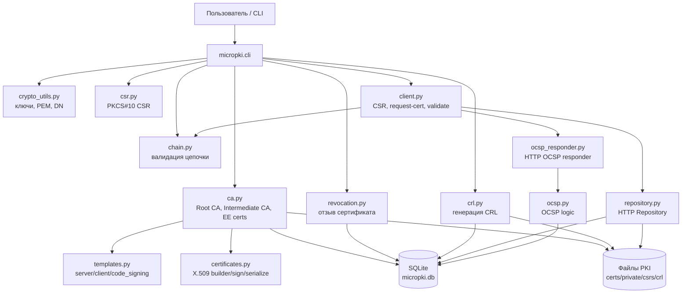
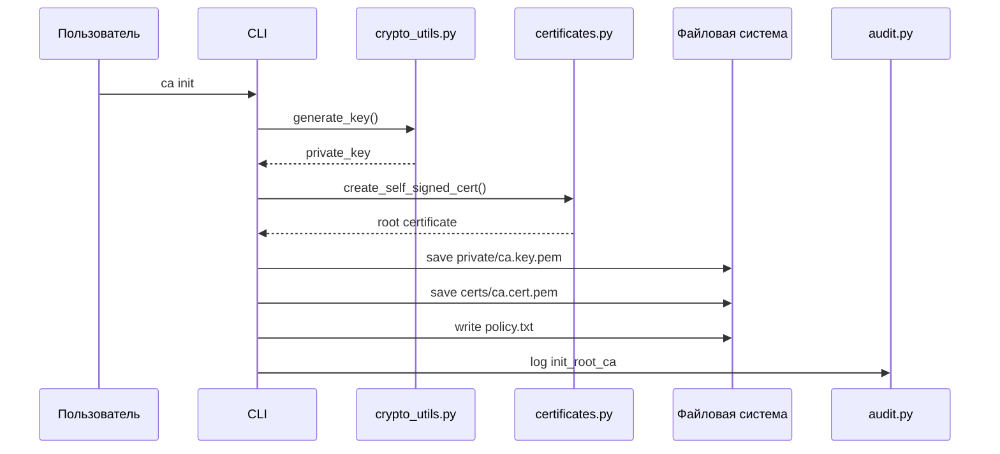
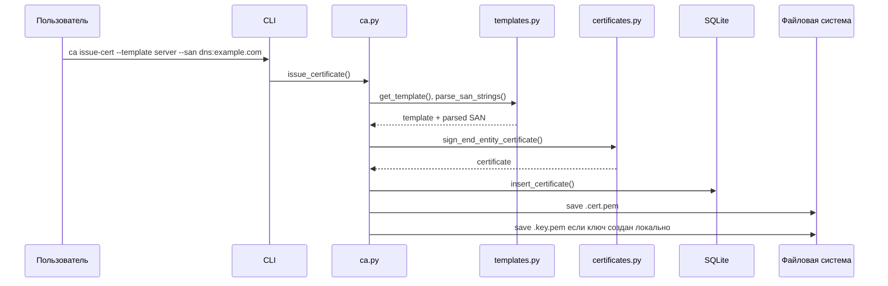
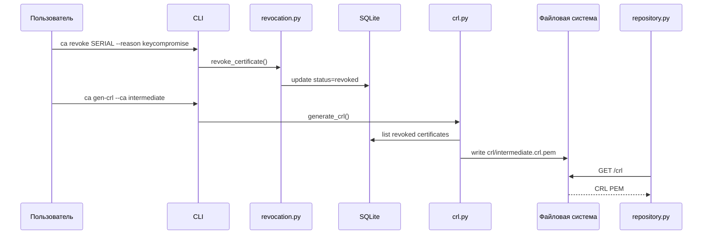
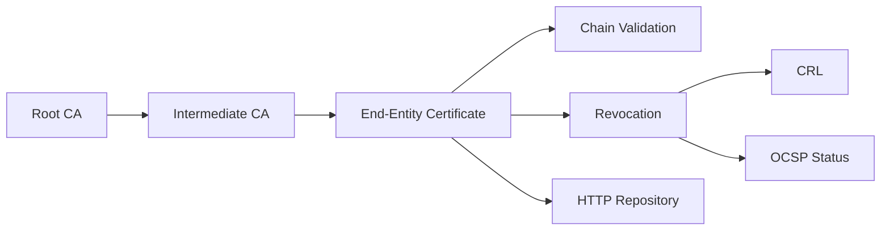

# MicroPKI

**MicroPKI** — учебная мини-инфраструктура открытых ключей на Python. Проект реализует базовые операции PKI: создание Root CA, выпуск Intermediate CA, выпуск конечных сертификатов по шаблонам, хранение сертификатов в SQLite, проверку цепочки, отзыв сертификатов, генерацию CRL, HTTP-репозиторий сертификатов и OCSP responder.

Проект предназначен для демонстрации полного жизненного цикла X.509-сертификата в локальной PKI.

---

## Содержание

1. [Назначение проекта](#назначение-проекта)
2. [Архитектура](#архитектура)
3. [Диаграммы процессов](#диаграммы-процессов)
4. [Соответствие спринтам](#соответствие-спринтам)
5. [Структура проекта](#структура-проекта)
6. [Установка и запуск](#установка-и-запуск)
7. [Примеры CLI-команд](#примеры-cli-команд)
8. [Тестирование](#тестирование)
9. [Безопасность и ограничения](#безопасность-и-ограничения)

---

## Назначение проекта

MicroPKI решает задачу построения минимальной, но целостной PKI-системы. В рамках проекта реализованы:

- генерация RSA и ECC ключей;
- создание самоподписанного Root CA;
- выпуск Intermediate CA;
- выпуск end-entity сертификатов по шаблонам `server`, `client`, `code_signing`;
- поддержка CSR;
- проверка цепочки сертификатов;
- хранение выпущенных сертификатов в SQLite;
- уникальная генерация серийных номеров;
- отзыв сертификатов;
- генерация CRL;
- HTTP-репозиторий сертификатов и CRL;
- OCSP responder;
- клиентские операции для генерации CSR, запроса сертификата и проверки статуса;
- аудит, базовые политики и ограничение частоты запросов.

---

## Архитектура



---

## Диаграммы процессов

### Выпуск Root CA



### Выпуск конечного сертификата



### Отзыв сертификата и CRL



### OCSP-проверка


---

## Соответствие спринтам

| Спринт | Требование | Реализация | Тесты | Статус |
|---:|---|---|---|---|
| 1 | Базовая криптография, Root CA, структура PKI | `crypto_utils.py`, `certificates.py`, `ca.py`, `logging_utils.py` | `test_crypto_utils.py`, `test_certificates.py`, `test_ca.py` | Реализовано |
| 2 | Intermediate CA, end-entity сертификаты, шаблоны, CSR, проверка цепочки | `ca.py`, `csr.py`, `templates.py`, `chain.py` | `test_intermediate.py`, `test_templates.py`, `test_csr.py`, `test_chain.py`, `test_cli_sprint.py` | Реализовано |
| 3 | SQLite-база, серийные номера, CLI list/show, HTTP repository | `database.py`, `serial.py`, `repository.py`, `cli.py` | `test_db_cli.py`, `serial_uniqueness.py`, `test_repository_api.py` | Реализовано |
| 4 | Отзыв сертификатов, причины отзыва, CRL, HTTP-доступ к CRL | `revocation.py`, `crl.py`, `repository.py` | `test_sprint4.py` | Реализовано |
| 5 | OCSP responder, OCSP signer certificate, ответы good/revoked/unknown, nonce | `ocsp.py`, `ocsp_responder.py`, `ca.py` | `test_sprint5.py` | Реализовано |
| 6 | Клиентские функции: CSR, запрос сертификата, validate, check-status | `client.py`, `revocation_check.py`, `repository.py` | `test_client_logic.py` | Реализовано |
| 7 | Усиление безопасности: аудит, политики, rate limiting, transparency log | `audit.py`, `policy.py`, `ratelimit.py`, `transparency.py` | покрывается частично интеграционными тестами и через вызовы CA/Repository/OCSP | Частично / опционально |
| 8 | Интеграция, CLI, документация, производительность, финальная проверка | `cli.py`, `__main__.py`, `README.md`, полный набор тестов | `test_performance.py`, полный `pytest -v` | Реализовано |

---

## Структура проекта

| Путь | Назначение |
|---|---|
| `micropki/__init__.py` | Публичный API пакета. Не должен импортировать несуществующие классы. |
| `micropki/__main__.py` | Точка входа при запуске `python -m micropki`. |
| `micropki/ca.py` | Основные операции CA: Root CA, Intermediate CA, end-entity сертификаты, OCSP signer certificate. |
| `micropki/certificates.py` | Создание, подпись, сериализация и загрузка X.509-сертификатов. |
| `micropki/crypto_utils.py` | Генерация ключей, сериализация PEM, загрузка ключей, разбор DN. |
| `micropki/csr.py` | Создание, сериализация, загрузка и проверка CSR. |
| `micropki/templates.py` | Шаблоны сертификатов `server`, `client`, `code_signing`, SAN и KeyUsage/EKU. |
| `micropki/chain.py` | Проверка цепочки сертификатов. |
| `micropki/database.py` | SQLite-хранилище сертификатов, статусов, revocation metadata и CRL metadata. |
| `micropki/serial.py` | Генерация уникальных серийных номеров сертификатов. |
| `micropki/revocation.py` | Отзыв сертификатов и маппинг причин отзыва в RFC 5280 ReasonFlags. |
| `micropki/crl.py` | Генерация CRL и сохранение CRL metadata. |
| `micropki/revocation_check.py` | Проверка статуса сертификата через OCSP с fallback на CRL. |
| `micropki/repository.py` | HTTP repository для сертификатов CA, leaf-сертификатов и CRL. |
| `micropki/ocsp.py` | Логика разбора OCSP-запросов и генерации OCSP-ответов. |
| `micropki/ocsp_responder.py` | HTTP OCSP responder. |
| `micropki/client.py` | Клиентские операции: CSR, запрос сертификата, validate, check-status. |
| `micropki/config.py` | Загрузка конфигурации из YAML или значения по умолчанию. |
| `micropki/audit.py` | Аудит операций. |
| `micropki/policy.py` | Проверки политик ключей, SAN и срока действия. |
| `micropki/ratelimit.py` | Token Bucket rate limiting. |
| `micropki/transparency.py` | Локальный transparency log для выпущенных сертификатов. |
| `tests/conftest.py` | Общие фикстуры для тестов. |
| `tests/test_*.py` | Набор unit, integration, CLI, repository, CRL, OCSP и performance-тестов. |

---

## Установка и запуск

### 1. Создать виртуальное окружение

Windows PowerShell:

```powershell
python -m venv .venv
.\.venv\Scripts\Activate.ps1
```

Если PowerShell блокирует активацию:

```powershell
Set-ExecutionPolicy -Scope Process -ExecutionPolicy Bypass
.\.venv\Scripts\Activate.ps1
```

### 2. Установить зависимости

```powershell
python -m pip install --upgrade pip
pip install cryptography requests pytest pytest-cov pyyaml
```

Минимальный `requirements.txt`:

```txt
cryptography>=42.0.0
requests>=2.31.0
pytest>=8.0.0
pytest-cov>=5.0.0
PyYAML>=6.0.0
```

### 3. Проверить импорты

```powershell
python -c "import micropki; import micropki.ca; import micropki.cli; print('imports ok')"
```

Ожидаемый результат:

```text
imports ok
```

---

## Примеры CLI-команд

### Инициализация Root CA

```powershell
python -m micropki ca init `
  --subject "CN=Demo Root CA,O=DemoOrg,C=RU" `
  --key-type rsa `
  --key-size 4096 `
  --passphrase-file .\pki\secrets\root.pass `
  --out-dir .\pki `
  --validity-days 3650
```

### Инициализация базы данных

```powershell
python -m micropki db init --db-path .\pki\micropki.db
```

### Выпуск Intermediate CA

```powershell
python -m micropki ca issue-intermediate `
  --root-cert .\pki\certs\ca.cert.pem `
  --root-key .\pki\private\ca.key.pem `
  --root-pass-file .\pki\secrets\root.pass `
  --subject "CN=Demo Intermediate CA,O=DemoOrg" `
  --key-type rsa `
  --key-size 4096 `
  --passphrase-file .\pki\secrets\intermediate.pass `
  --out-dir .\pki `
  --validity-days 1825 `
  --pathlen 0
```

### Выпуск server-сертификата

```powershell
python -m micropki ca issue-cert `
  --ca-cert .\pki\certs\intermediate.cert.pem `
  --ca-key .\pki\private\intermediate.key.pem `
  --ca-pass-file .\pki\secrets\intermediate.pass `
  --template server `
  --subject "CN=app.example.com,O=DemoOrg" `
  --san "dns:app.example.com" `
  --out-dir .\pki\certs `
  --validity-days 365
```

### Проверка цепочки сертификатов

```powershell
python -m micropki ca validate-chain `
  --cert .\pki\certs\app.example.com.cert.pem `
  --intermediate .\pki\certs\intermediate.cert.pem `
  --root .\pki\certs\ca.cert.pem
```

### Отзыв сертификата

```powershell
python -m micropki ca revoke SERIAL_HEX --reason keycompromise --force
```

### Генерация CRL

```powershell
python -m micropki ca gen-crl --ca intermediate --out-dir .\pki
```

---

## Тестирование

### Запуск всех тестов

```powershell
pytest -v
```

### Запуск конкретного тестового файла

```powershell
pytest -v tests/test_ca.py
pytest -v tests/test_sprint4.py
pytest -v tests/test_sprint5.py
```

### Запуск без долгих тестов

Если performance-тест помечен как `slow`:

```powershell
pytest -v -m "not slow"
```

---

## Таблица тестов

| Файл | Что проверяет | Спринт |
|---|---|---:|
| `tests/test_crypto_utils.py` | Генерация RSA/ECC ключей, PEM-сериализация, DN parsing | 1 |
| `tests/test_certificates.py` | X.509 v3, BasicConstraints, KeyUsage, SKI/AKI, PEM save/load | 1 |
| `tests/test_ca.py` | Самопроверка Root CA, соответствие ключа и сертификата, encrypted key | 1 |
| `tests/test_csr.py` | Создание и проверка CSR, BasicConstraints в CSR | 2 |
| `tests/test_templates.py` | Шаблоны server/client/code_signing, SAN validation, KeyUsage | 2 |
| `tests/test_intermediate.py` | Intermediate CA, end-entity сертификаты, негативные сценарии | 2 |
| `tests/test_chain.py` | Проверка цепочки leaf → intermediate → root | 2 |
| `tests/test_cli_sprint.py` | CLI для issue-intermediate, issue-cert, validate-chain, CSR signing | 2 |
| `tests/test_db_cli.py` | SQLite-хранилище, list/show сертификатов через CLI | 3 |
| `tests/serial_uniqueness.py` | Уникальность серийных номеров, duplicate serial rejection | 3 |
| `tests/test_repository_api.py` | HTTP repository: `/ca/root`, `/ca/intermediate`, `/certificate/<serial>`, `/crl` | 3–4 |
| `tests/test_sprint4.py` | Revocation lifecycle, CRL number increment, HTTP CRL, OpenSSL verify | 4 |
| `tests/test_sprint5.py` | OCSP signer profile, good/revoked/unknown, nonce, malformed request, full workflow | 5 |
| `tests/test_client_logic.py` | Клиентская генерация CSR, validate, check-status | 6 |
| `tests/test_performance.py` | Массовый выпуск 1000 сертификатов | 8 |

---

## Безопасность и ограничения

Проект является учебной реализацией PKI. Его можно использовать для лабораторных работ, демонстраций и локального тестирования, но не как production-grade CA.

Ключевые ограничения:

- end-entity private key может сохраняться без шифрования, что допустимо только для учебного стенда;
- OCSP responder и repository рассчитаны на локальную демонстрацию;
- доверие к Root CA задаётся вручную;
- нет полноценной HSM-интеграции;
- нет production-grade access control;
- audit/transparency реализованы как локальные журналы, а не как внешняя доверенная система.

Практические меры безопасности, уже заложенные в проект:

- private key Root CA и Intermediate CA сохраняются в encrypted PEM;
- для файлов ключей используются ограниченные права доступа, где это поддерживается ОС;
- SAN и срок действия проверяются политиками;
- wildcard SAN можно запретить политикой;
- HTTP repository и OCSP responder имеют rate limiting;
- revoked-сертификаты фиксируются в SQLite и попадают в CRL.

---

## Итог

MicroPKI покрывает полный учебный цикл работы PKI:



Проект соответствует основной логике спринтов 1–8: от базовой криптографии и выпуска сертификатов до проверки цепочек, revocation lifecycle, OCSP responder, клиентских функций, тестирования и документации.
